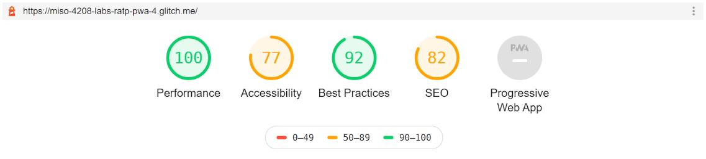
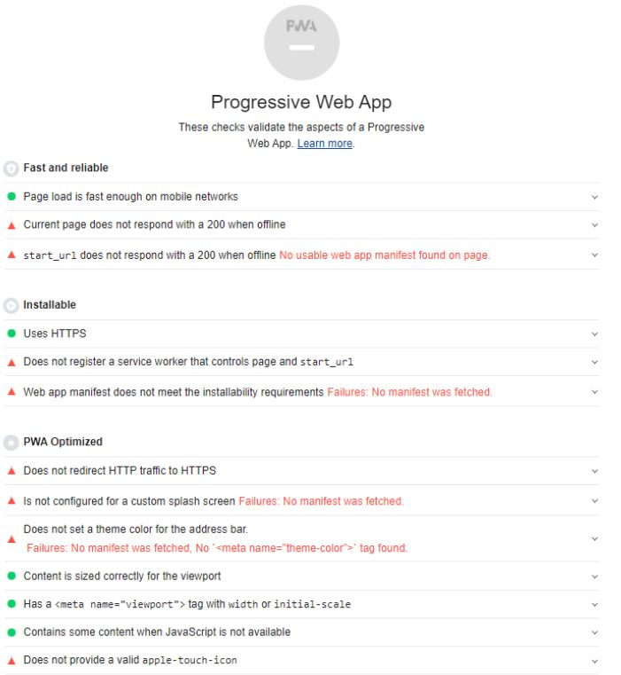
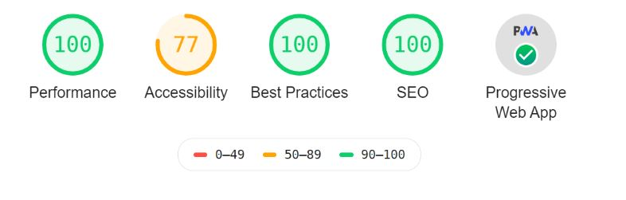
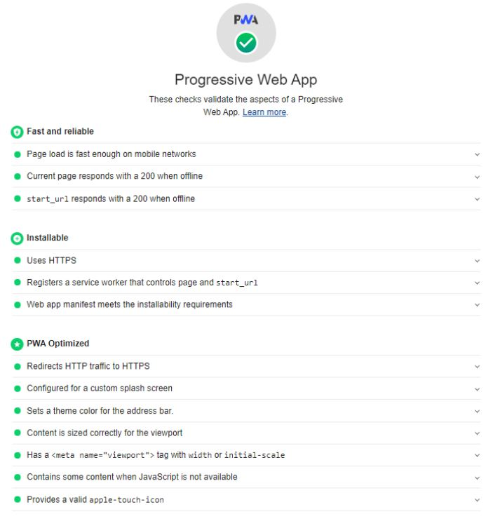

# ratp-pwa

Reporte de Lighthouse antes de desarrollar las funcionalidades del taller:

Para llevar a cabo todas las funcionalidades del taller usé las siguientes herramientas:

-Precaché nativo del Service Worker usando la estrategia #stale-while-revalidate.

-LocalForage para el almacenamiento de las estaciones.

-Firebase para el despliegue de la aplicación.

-web app manifest.

Reporte final de Lighthouse despues de desarrollar las funcionalidades requeridas y de ser desplegado:

https://metro-pwa-a109a.firebaseapp.com/

